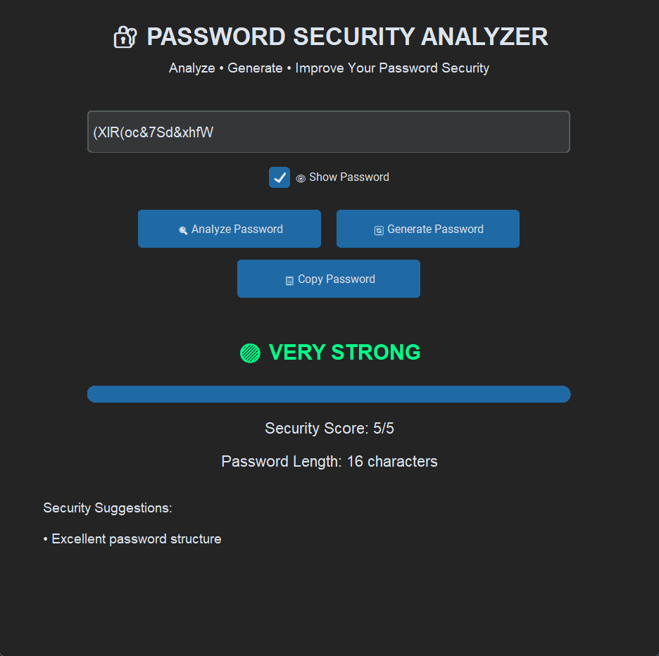

# Password-Security-Analyzer
A professional Python-based password security analysis tool with a modern GUI.
## ✨ Features

- 🔍 Password strength analysis
- 📊 Security score
- 📈 Strength progress bar
- 🔴 Weak / 🟠 Medium / 🟢 Strong status
- 👁 Show / Hide Password
- 🔄 Secure password generator
- 📋 Copy password button
- 📝 Detailed security suggestions
- 📏 Password length analysis
- 🌙 Modern dark GUI

## 🛠️ Technologies Used

- Python
- CustomTkinter
- Python Secrets Module
- Regular Expressions

## 🚀 How to Run

Install the required dependencies:

```bash
pip install -r requirements.txt

Run the application:
python main.py


